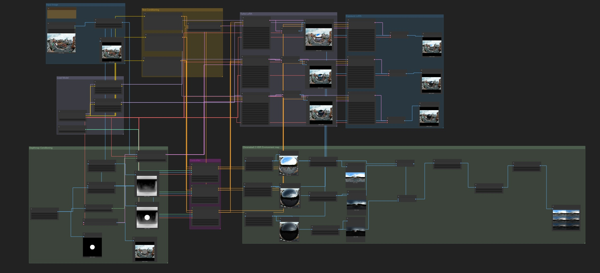

# DiffusionLight-ComfyUI


DiffusionLight (Turbo) implemented in ComfyUI

This repository is recommended for non-researchers who want to extract lighting information from any image.

Unlike the main DiffusionLight repository, which requires 16GB of VRAM to run, this ComfyUI implementation enables machines with lower VRAM to operate the model efficiently.

If you are looking for more in-depth details, please visit the [DiffusionLight's Main repository](https://github.com/DiffusionLight/DiffusionLight)



## How to use 
1. Select Input Image
2. Click Run
3. The output HDR Environment map `DiffusionLight-0001.hdr` will appear at `ComfyUI/output`

## Installation 

1. Get [ComfyUI](https://github.com/comfyanonymous/ComfyUI)
2. Install [ComfyUI-Manager](https://github.com/Comfy-Org/ComfyUI-Manager)
3. Install [comfyui_controlnet_aux](https://github.com/Fannovel16/comfyui_controlnet_aux)
4. Download the Stable Diffusion checkpoints: 
- 4.1. [SDXL Based model (With VAE fix)](https://civitai.com/models/101055) and put into ComfyUI/models/checkpoints
- 4.2. [SDXL Depth ControlNet](https://huggingface.co/diffusers/controlnet-depth-sdxl-1.0/blob/main/diffusion_pytorch_model.safetensors) and put into `ComfyUI/models/controlnet`
- 4.3. [DiffusionLight's Exposure LoRA](https://vistec-my.sharepoint.com/:u:/g/personal/pakkapon_p_s19_vistec_ac_th/ET-PEbnf5DtDv0c8D0Xvo6gBCVIXL319hmKvFt_nk4jXJg?e=c2gbaA) and put into `ComfyUI/models/loras`
- 4.4.  [DiffusionLight's Turbo LoRA](https://vistec-my.sharepoint.com/:u:/g/personal/pakkapon_p_s19_vistec_ac_th/EeaTEJegQ7tBqQHhNRihyRIBIBBoJYZy-IenH0aZgLf6gQ?e=Rk4ebd) and put into `ComfyUI/models/loras`
5. Clone this repository and place it in `ComfyUI/custom_nodes`
6. Run ComfyUI and import the workflow file [diffusionlight-workflow.json](diffusionlight-workflow.json) from this repository

## Citation

```
@inproceedings{Phongthawee2023DiffusionLight,
    author = {Phongthawee, Pakkapon and Chinchuthakun, Worameth and Sinsunthithet, Nontaphat and Raj, Amit and Jampani, Varun and Khungurn, Pramook and Suwajanakorn, Supasorn},
    title = {DiffusionLight: Light Probes for Free by Painting a Chrome Ball},
    booktitle = {ArXiv},
    year = {2023},
}
```

## Visit us 🦉
[](https://vistec.ist/vision) [](https://vistec.ist/)
